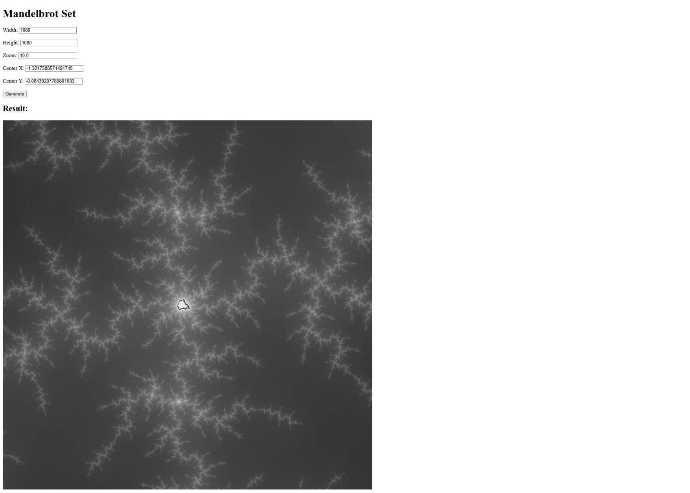

# Fractals
This project is Mandelbrot Visualizer. Its from my previous [project](https://github.com/itahang/Mandelbrot-set-CUDA).

It need Nvidia GPU to run along with CUDA runtime.
If you have Cuda Toolkit then you dont need to install other Nvidia Drivers.

### To use 


```shell
    git clone https://github.com/itahang/Fractals.git
```

```shell
    cd Fractals
```

Install all dependencies

```shell
    pip install -r requirements.txt
```

Run the server

```
    uvicorn app.main:app   
```


## Preview





